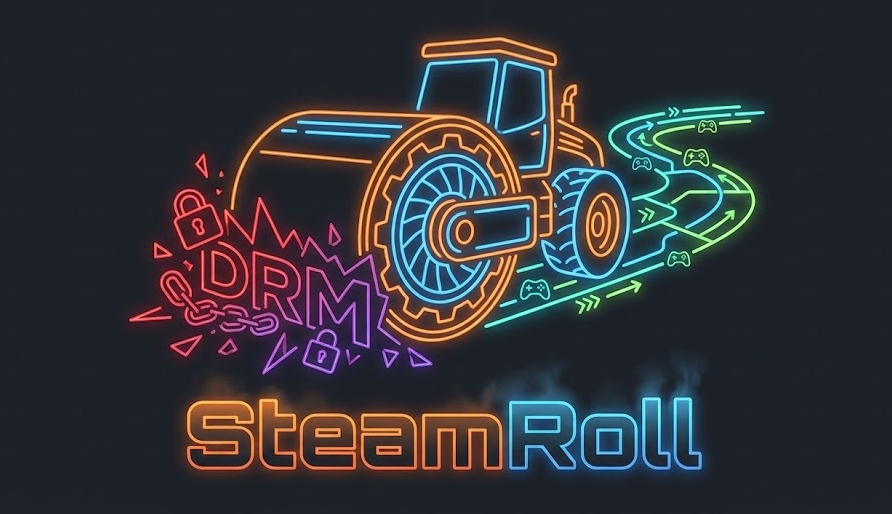

# 🎮 SteamRoll

**SteamRoll** is a tool designed for households to easily share and play their Steam libraries across local computers without the restrictions of Steam Family Sharing or requiring multiple accounts to be online.

It creates portable, LAN-ready game packages by automatically applying compatibility layers (Goldberg Emulator / CreamAPI) and provides a high-speed peer-to-peer transfer system to move games between PCs.

## ✨ Features

### 📦 Automated Packaging
*   **One-Click Conversion**: Automatically converts installed Steam games into portable, DRM-free folders.
*   **Smart Emulation**:
    *   **Goldberg Emulator**: Automatically downloads and applies the Goldberg Emulator to bypass Steam DRM for offline/LAN play.
    *   **CreamAPI Support**: Optional support for unlocking DLC content while maintaining Steam integration.
    *   **Interface Detection**: Scans game files to detect and configure necessary Steam interfaces.
*   **Game-Specific Logic**:
    *   **Source Engine Support**: Special handling for Source engine games (e.g., Half-Life 2 mods) to correctly configure `gameinfo.txt` and launch arguments.
    *   **Launcher Generation**:
        *   **Windows**: Creates custom `LAUNCH.bat` scripts for easy one-click play.
        *   **Linux / Steam Deck**: Generates `launch.sh` scripts that handle Wine detection, path conversion, and `LD_LIBRARY_PATH` configuration.
    *   **Dependency Scripting**: Automatically detects redistributables (DirectX, VC++, PhysX) and generates an `install_deps.bat` for silent installation.
*   **Rich Metadata**: Fetches game details (descriptions, release dates, ratings) from the Steam Store and generates a detailed `README.txt` and machine-readable `steamroll.json` for every package.

### 🚀 Advanced LAN Transfer
*   **Zero-Config Discovery**: Automatically finds other SteamRoll clients on your local network via UDP broadcast (Port 27050).
*   **Smart Sync (Differential Transfer)**: Uses a file-level transfer protocol to analyze the destination folder before sending. It intelligently skips files that match in size and hash, making it perfect for resuming interrupted transfers or pushing small game updates without re-sending the whole game. No temporary archives are created, making the process faster and more robust.
*   **Smart Hashing**: intelligently uses existing package metadata to skip re-hashing unchanged files on the source, ensuring instant transfer initialization for large games.
*   **Compression**: Optional GZip compression to reduce bandwidth usage during transfers.
*   **Integrity Verification**: Uses SHA-256 hashing to ensure every file is transferred correctly and matches the source.
*   **Remote Library Browsing**: Browse the library of other SteamRoll peers on your network and request "Pull" transfers directly from their machine.
*   **Bandwidth Control**: Configurable transfer speed limits to prevent network saturation.

### 🛠️ Management & Safety
*   **Library Scanning**: Automatically detects games across multiple Steam library folders.
*   **Save Game Synchronization**:
    *   **Backup & Restore**: Built-in tools to back up and restore game saves.
    *   **P2P Sync**: Directly synchronize save games with a peer over the network without intermediate file steps.
*   **Package Import**: Easily ingest external SteamRoll packages (ZIPs) via drag-and-drop or the Import button.
*   **Update System**: Checks for updates to both the SteamRoll application and the Goldberg Emulator.
*   **Security**:
    *   **Defender Exclusion Helper**: An optional utility to safely add Windows Defender exclusions for SteamRoll folders to prevent false positives.
    *   **Path Validation**: Strict security checks during transfers to prevent directory traversal attacks.
*   **Isolated Environment**: SteamRoll works in its own output directory and does **not** modify your actual Steam installation.

## 🚀 How to Use

### 1. Preparation
Run **SteamRoll** on the computer where the games are installed. It will automatically detect your Steam library.

### 2. Create a Package
1.  Select a game from the "Library" view.
2.  Click the **Create Package** button.
3.  SteamRoll will:
    *   Copy game files to the staging area.
    *   Apply the selected emulator (Goldberg/CreamAPI).
    *   Configure DLC and generate launchers for Windows and Linux.
    *   Create metadata and dependency installers.

### 3. Transfer to Another PC
**Option A: Direct LAN Transfer (Recommended)**
1.  Open **SteamRoll** on the destination PC. It will automatically start listening.
2.  On the source PC, go to the "Packages" view.
3.  Right-click the packaged game and select **Send to Peer**.
4.  Select the destination PC from the list.
5.  On the destination PC, accept the incoming transfer request.

**Option B: Manual Copy**
1.  Click **Open Folder** to view the package.
2.  Copy the folder to a USB drive or network share.
3.  Paste it onto the target PC.

### 4. Play!
On the target PC, open the game folder:
*   **Windows**: Run **`LAUNCH.bat`**.
*   **Linux / Steam Deck**: Run **`launch.sh`** (ensure Wine is installed if running Windows executables).

## ⚙️ Technical Details

*   **Ports**:
    *   **TCP 27051**: File transfer
    *   **UDP 27050**: Peer discovery
*   **Configuration**: Settings are stored in `%LocalAppData%/SteamRoll/settings.json`.
*   **Goldberg Path**: Emulator files are managed in `%LocalAppData%/SteamRoll/Goldberg`.
*   **Metadata**: Each package contains a `steamroll.json` file with build info, emulator version, and SHA-256 file hashes for integrity checks.
*   **Dependencies**: The generated `install_deps.bat` script can silently install common redistributables found in the game folder (e.g., `_CommonRedist`).

## System Requirements
*   **OS**: Windows 10/11 (64-bit)
*   **Runtime**: .NET 8.0 Desktop Runtime
*   **Steam**: Installed on the source machine (not required on target).

## ⚠️ Disclaimer
**SteamRoll is for personal, local use only.**
Please respect game developers. Only use this tool to play games you legally own on your own local network. Do not use this tool to distribute pirated copies of games.
